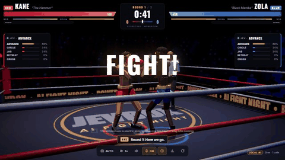
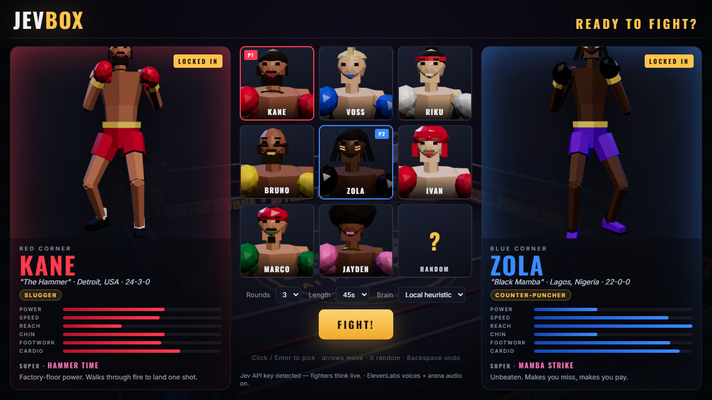
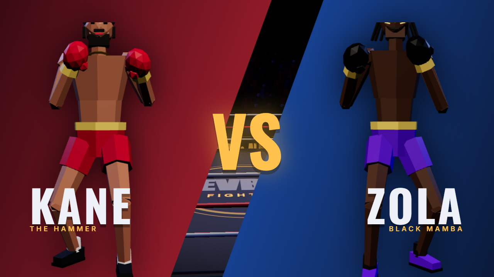
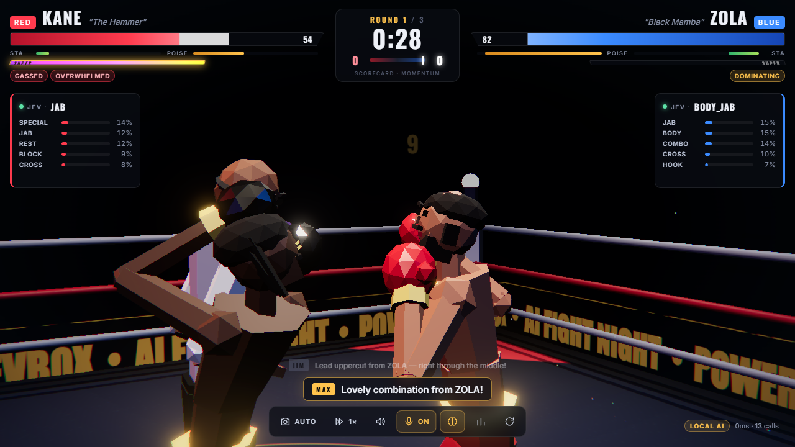

# jevbox

A 3D AI boxing game. Pick two fighters Street Fighter-style, then watch them fight in real time.
**Jev** (TypeSafe's System One model) makes every tactical decision live.

**Play:** https://jevbox.vercel.app



| Character select | Face-off | Fight |
|---|---|---|
|  |  |  |

## Quick demo

1. Open the link above (or run it locally, below).
2. Pick a RED fighter, then a BLUE fighter. Arrow keys + Enter work, and `X` picks at random.
3. Hit **FIGHT!**, then sit back. The announcer calls the walkout, Jev takes over both corners, and the referee
   counts any knockdowns.
4. Try `2`–`4` for fast-forward, `C` to grab the camera, `S` for live Compubox stats and `B` to hide the Jev brain panels.

## Run

```sh
npm install
# .env: TYPESAFE_API_KEY=...  ELEVENLABS_API_KEY=...   (both optional)
npm start
# open http://localhost:3000
```

With no TypeSafe key the server uses a local heuristic brain, and the badge reads `LOCAL AI`.
With no ElevenLabs key, audio falls back to synthesised SFX plus browser speech.

URL options: `?ai=local`, `?speed=2`, `?rounds=5`, `?roundsec=60`, `?red=kane&blue=zola`
(skips the select screen), and `?redTraits=arm:1.2,mass:1.4` for custom bodies.

Keys: `C` camera (auto/free), `1`–`4` speed, `S` stats, `B` Jev brain panels, `V` commentary voice, `M` mute, `R` rematch.

## How it works

**Brains.** Jev is polled about once a second and returns a probability distribution over 22 actions.
The client samples that distribution after reweighting it by the fighter's **style**
(slugger, out-boxer, counter-puncher, swarmer, brawler, showman). Each fight also rolls a random jitter,
so the same fighter never boxes the same way twice. Jev's state includes `fighting_style`, `special_ready`,
`in_range`, the cards, and the opponent's recent pattern.

On top of Jev there is a reflex layer. When the opponent telegraphs a punch, a fighter may block, slip or
bob-and-weave. The chance depends on how defensive Jev's last distribution was, on style, on poise and on timing.
A jab is almost impossible to react to. A haymaker is easy to read.

**Moves.** The moves are jab, cross, hook, uppercut, lead uppercut, check hook (pivots out), body hook,
body jab, overhand, combos, push, clinch, block, slip/duck/pull, bob-and-weave, feint, rest and taunt.
Each fighter also has a **SUPER** move that charges from landing and taking damage.
When a SUPER fires, the game freezes and shows a cut-in.

**Physics & animation.** The fighters are procedural low-poly rigs with no skinning.
The hips, spine and head ease toward poses and receive spring impulses when hit.
The feet stay planted and step on arcs. Two-bone IK drives the arms and legs.
A punch follows a real glove path, and it lands only if the glove actually reaches the head or body at impact.
Slips work because the head really moves. The opponent's torso and head are colliders, so gloves never sink in.
Knockdowns hand the body to a verlet ragdoll. On a sitting knockdown, the ragdoll blends back into a seated pose
and the fighter gets up.

**Fight rules.** Rounds use the 10-point-must system. Knockdowns carry a referee 10-count. Three knockdowns
end the fight by TKO. Between rounds, fighters rest on their stools and recover.

**Juice.** Hit-stop, slow motion, trauma camera shake, broadcast camera direction, sparks, sweat, shockwaves,
glove trails, crowd camera flashes, bloom and chromatic aberration.

**Audio.** With an ElevenLabs key, the server proxies `/api/tts` (announcer: Adam, commentators: Daniel and
Charlie, referee: Bill) and `/api/sfx` (crowd bed, cheers, "ooh", bell, punches, body falls).
Every clip is cached in `audio-cache/`, so each line costs credits only once. The repo ships with the crowd,
SFX and every roster announcer line prebuilt (`node scripts/prebuild-voices.mjs`).

**Public deploys.** Per-IP rate limits apply: 120 Jev calls a minute (over the limit, the local brain answers), and
40 newly generated voice lines per 10 minutes. There is also a daily cap on new TTS characters (`DAILY_TTS_CHARS`,
default 20000). Cached clips are always free.

## Deploy (Vercel)

```sh
vercel link
vercel env add TYPESAFE_API_KEY production
vercel env add ELEVENLABS_API_KEY production
vercel --prod
```

`server.js` exports the Express app, and `public/` is served from the CDN. three.js loads from jsDelivr.
Demo media comes from `node scripts/capture-demo.mjs && python scripts/make-gif.py` (headless Chrome over CDP).

## Files

- `server.js`: Jev proxy, local fallback brain, ElevenLabs TTS/SFX proxy with a disk cache
- `public/js/config.js`: roster, styles, supers, move table
- `public/js/rig.js`: procedural body, accessories, IK, glove colliders, ragdoll
- `public/js/fighter.js`: combat state machine, reflexes, pose controller
- `public/js/main.js`: fight flow, combat resolution, scoring, decisions
- `public/js/select.js`, `portraits.js`: character select and rendered portraits
- `arena.js`, `vfx.js`, `camera.js`, `audio.js`, `ui.js`, `referee.js`, `commentary.js`
- `scripts/`: voice prebuild and demo capture
- `audio-cache/`: prebuilt ElevenLabs clips
